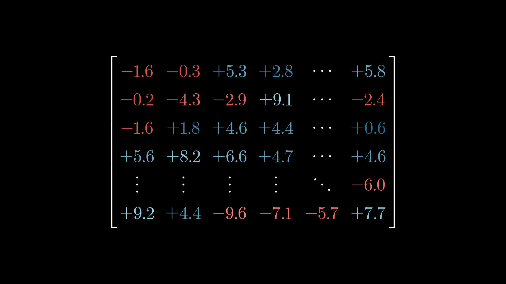
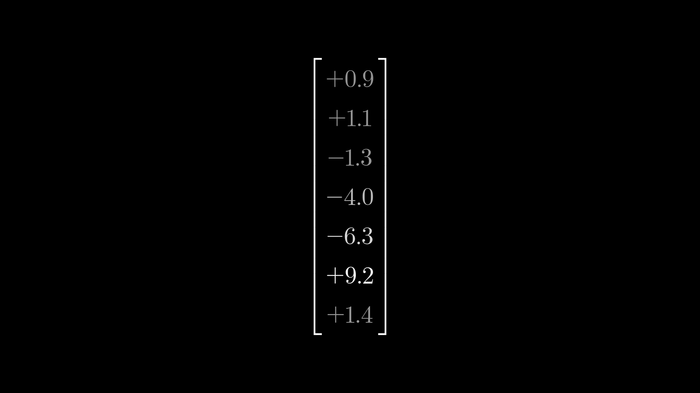
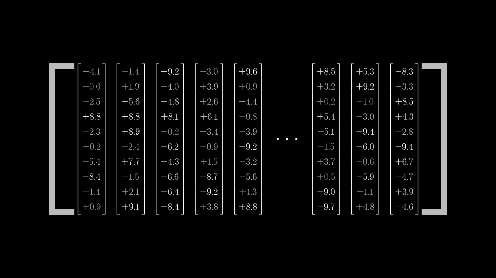
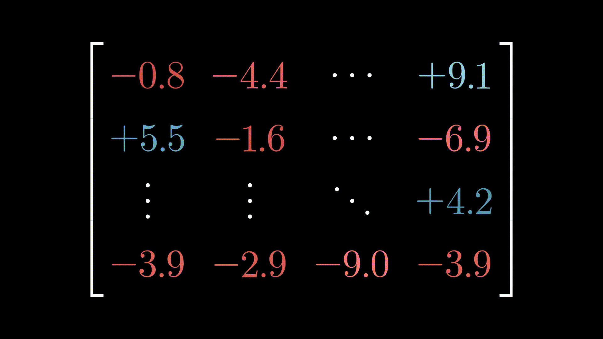
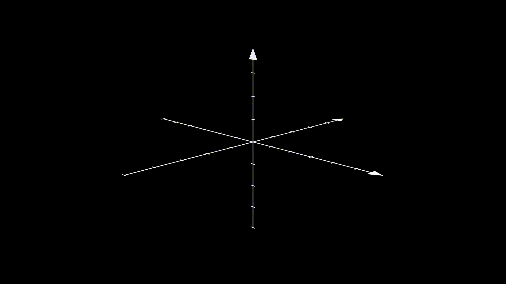
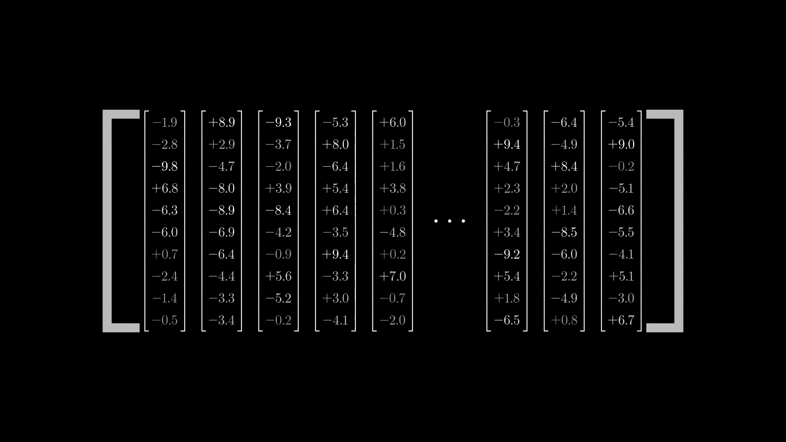
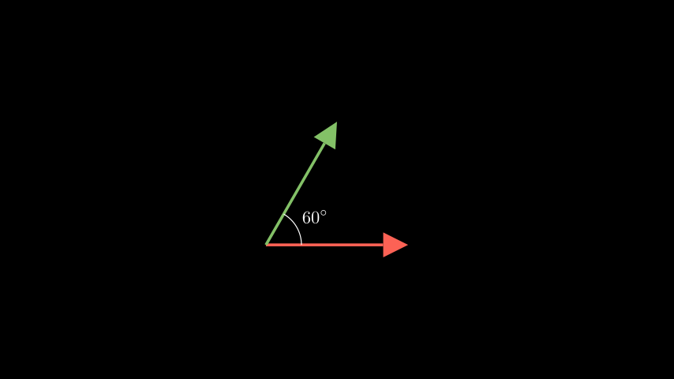
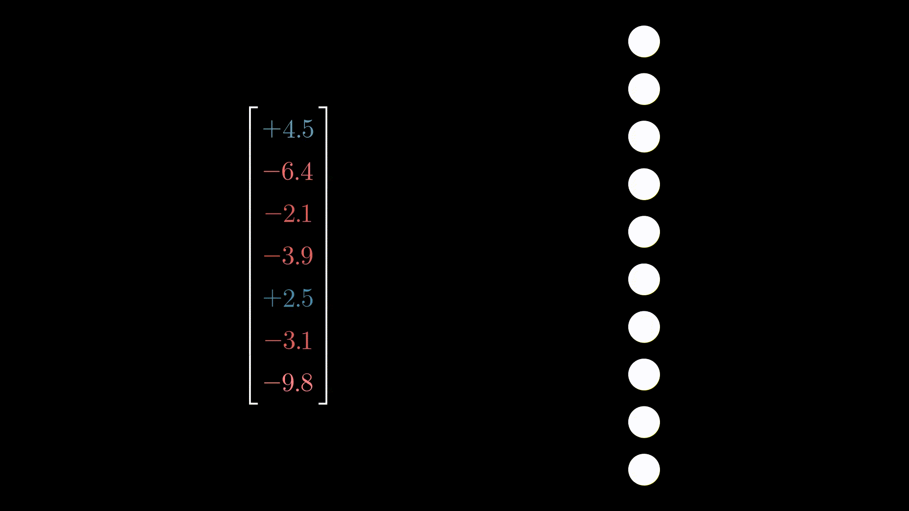
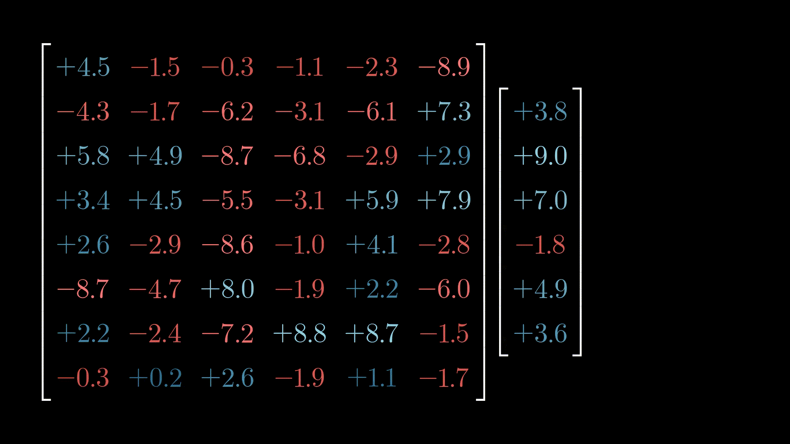
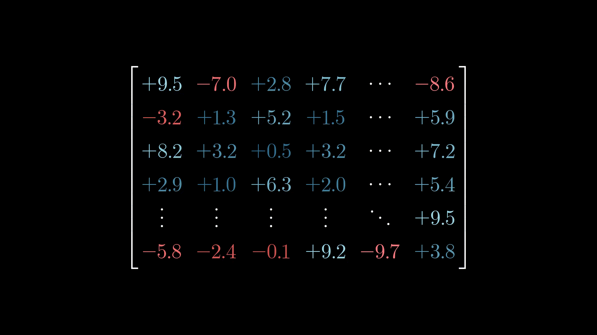

# Manimによる深層学習の可視化

## Manimとは

**Manim**は、数学的な概念を視覚化するためのアニメーションを作成することに特化した、Pythonの**オープンソースライブラリ**である。もともとは、世界的に有名な数学解説YouTubeチャンネル「3Blue1Brown」の制作者であるGrant Sanderson氏によって、自身の動画制作用に開発された。 
Manimを使えば、数式、グラフ、図形、幾何学的な変換、アルゴリズムの動作などを、プログラムコードを通して正確かつ美しくアニメーションとして表現できる。

Manimには２つのバージョンが存在し、一般的にManim Community Editionが推奨される 
1. Manim Community Edition(manim ce)
   - コミュニティによって活発に開発・メンテナンスが行われている
   - ドキュメントが豊富で、インストールも`$ pip install manim`で可能
   - これからManimを始めるほとんどの人におすすめのバージョン
   - 公式ドキュメントは[こちら](https://docs.manim.community/en/stable/index.html)
2. Manim GL 
   - Grant Sanderson氏自身が現在も使用しているオリジナルバージョン
   - セットアップが複雑な場合がある
   - [3Blue1Brown](https://www.youtube.com/@3blue1brown)の動画はこっちのバージョンで作成されている

Manimは内部でLaTeXやffmpegを使用するため、別途インストールが必要。インストールの際は[こちらの記事](https://meta-perceptio.vercel.app/pages/manim.html)が参考になる。

## Manim CE(v0.19.0)による深層学習の可視化

深層学習について直感的な理解を促すためには、図やグラフを使って可視化することが有効である。そのため、Manim CEによって深層学習を可視化するためのパッケージを構築することを目指す。

ここでは、構築したプログラムとその内容についてまとめる。

1. NeuralNetwork.py (開発済み)
   - `NeuralNetworkMobject`：シンプルな多層パーセプトロンを構築するためのクラス。
     - 順伝播と逆伝播の際のアクティベーションなどを可視化するメソッドを用意。`forward_pass_animation,backprop_animation`
    - ニューロンの数や層数はリストを渡すことで決定できる。`nn = NeuralNetworkMobject([5, 20, 14, 8])`
  
    
   
   - Modelを受け取り、そのアクティベーションによって色の変化が変わる`NeuralNetworkWithActivation`を実装
  
   

    

2. Convolution.py (開発済み)(名前未定)
    - 主にCNNを可視化するためのプログラム
      - `Convolution`:畳み込み演算を可視化するためのクラス。
      - `CalConvolution`:畳み込み演算を実査に計算し特徴マップを作成する過程を可視化する。少しレンダリングが重いため、画像サイズには注意が必要。
      - `PixelsAsSquare`：画像のピクセルをSquareで表示するためのクラス。(グレースケール用)
  
        

      - `PixelsAsSquareColor`：画像のピクセルをSquareで表示するためのクラス。(カラー用)
        - 画像はNumpy配列に変換されている必要があるが、画像をNumpy配列に変換するための関数`image_to_array`も用意。
    - Numpy配列をManim.Matrixに変換するための関数`array_to_matrix`も用意。
  
    

3. Transformer.py　(開発中)
   - トランスフォーマーにおける演算などを可視化するクラス。
    
   a. `WeightMatrix`：重み行列を可視化するクラス。数値によって色を変更。
     
   b. `NumericEmbedding`：埋め込みベクトルを可視化するクラス。
     
   c. `EmbeddingArray`：埋め込み行列を可視化するクラス。
     
   d. `RandomizeMatrixEntries`：重み行列の要素をランダムに変更するアニメーションを返す。
     
   e. `MachineWithDials`：複数のダイアルを持つMobject。
  　  
   f. `TextLabeledArrow`：ラベル付きのArrowを作成。ManimCEにはLabeledArrowクラスが用意されているため。使い分ける。
     
   g. `ContextAnimation`：sourceからtargetに向けて弧を描くような光のアニメーションを返す。
     
   h. `NeuralNetwork`：多層パーセプトロンを可視化するクラス。ランダムにノードとエッジの色を変化。
     
   i. `get_vector_pair`：間の角度を指定すると、２つのベクトル(Vecotr)を返すメソッド。
     
   j. `get_network_connections`:ネットワークのエッジ(Line)を返すメソッド。
     
   k. `create_pixels`：ImageMobectをPixelsに分割するメソッド。
     
   l. `show_matrix_vector_product`：行列とベクトルの積を可視化するメソッド。
     
   m. `data_modifying_matrix`：データによって行列の数値が変化するアニメーションを返すメソッド。
    
   n. `show_symbolic_matrix_vector_product`：行列とベクトルの積を可視化するメソッド。こちらは数値計算を行わない。
     
   o. `get_full_matrix_vector_product`：行列とベクトルの積を返すメソッド。こちらは計算過程のアニメーションなし。
     

